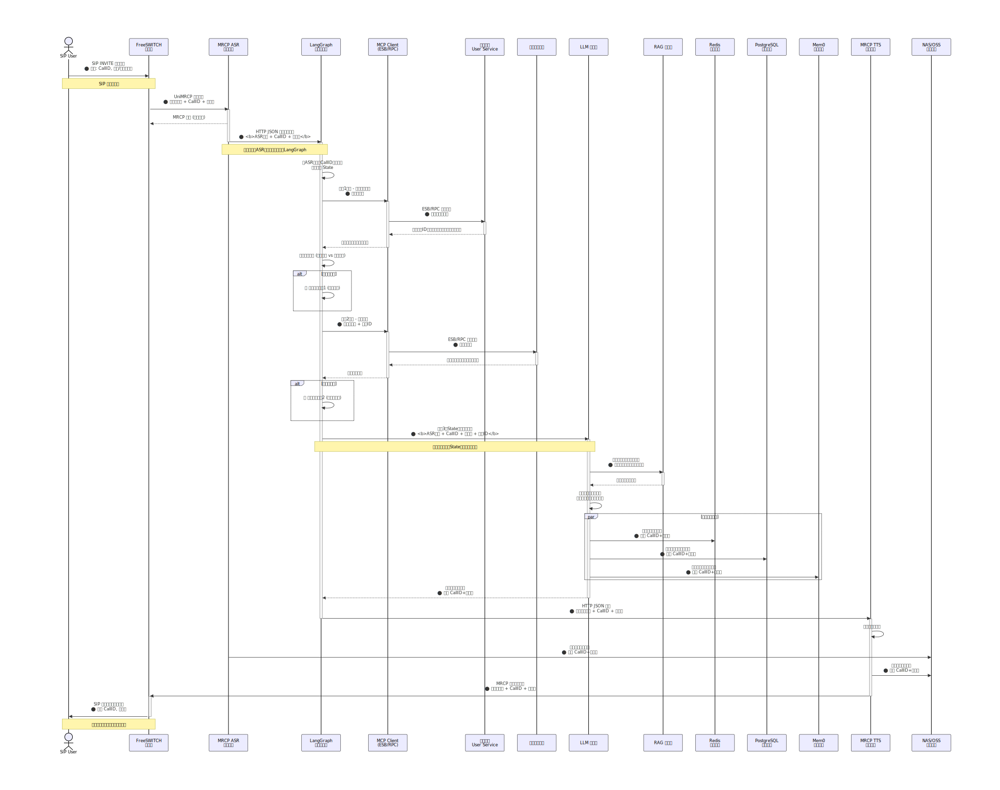

# 智能外呼系统
采用分层流向架构，从底层通信层→语音交换层→语音识别层→流程编排层→业务服务层→大模型智能层→存储层→语音合成层→语音播放层，严格按业务数据流顺序绘制，**全程同步透传唯一通话标识CallID与用户手机号两大核心标识**，标注所有通信协议、调用方式、事件通知、数据传递逻辑，完整业务流转流程如下：

1. **接入层**：SIP User发起外呼通话，通话媒体流、通话唯一标识CallID、主叫/被叫用户手机号同步上行传输
2. **语音交换层**：通话接入FreeSWITCH软交换，负责媒体流转发、通话事件调度、上下行语音流中转，全程携带CallID+手机号
3. **语音识别层**：FreeSWITCH基于UniMRCP协议对接MRCP ASR语音识别引擎，通过事件通知机制传输实时用户语音流，ASR引擎完成语音转文字，生成**同时携带CallID与用户手机号**的ASR识别文本
4. **编排接入层**：**ASR识别文本携带CallID+用户手机号，以HTTP JSON接口推送至LangGraph流程编排调度器**，文本、CallID、手机号统一存入LangGraph全局状态State中持久留存，不丢失原始用户对话与身份标识数据
5. **LangGraph第一业务节点（用户身份核验）**
编排引擎内置MCP Client，通过HTTP Streamable传输协议调用java-mcp-server用户中心MCP服务，**传入用户手机号**调用`user_identity_query`工具；查询获取用户ID、脱敏手机号、身份证后四位，流程全程保留State内ASR文本、CallID、手机号
6. **LangGraph第二业务节点（征信合规核验）**
复用MCP Client调用java-mcp-server，**使用用户ID**调用`user_credit_query`工具，获取用户征信档案数据，校验征信资质与风险等级（仅marketing业务类型触发），征信不合规直接触发风控预警，以上两个业务节点执行全程保留LangGraph状态内的ASR原始文本、CallID、手机号
7. **LangGraph第三业务节点（ASR文本送入LLM智能应答生成）**
**从LangGraph全局State中提取完整ASR用户识别文本、CallID、用户手机号、用户ID**，统一送入LLM大模型；LLM解析用户语音文本语义，结合用户手机号绑定的历史用户数据，自主判定是否调取RAG知识库匹配业务标准话术，最终生成标准化外呼应答话术文本；依托LangChain Memory记忆体系做分层数据存储：Redis存储短期会话记忆、PostgreSQL(PG)存储长期业务会话数据、Mem0存储永久全域对话记忆，同步记录实时对话内容、语音文件存储路径、绑定手机号与CallID关联关系，支持客户二次呼入时通过**用户ID/手机号/CallID**双维度调取全量历史会话数据，结合历史对话信息生成连贯应答话术
8. **语音合成下发层**：LangGraph将LLM生成的应答话术文本，附带CallID与手机号标识，通过HTTP JSON请求推送至TTS语音合成服务，完成文字转语音音频生成，将用户原始识别语音、合成应答语音统一归档存储至NAS私有存储或OSS对象存储，音频文件关联绑定CallID+手机号
9. **引擎联动通知层**：TTS语音合成完成后，主动发送事件通知至MRCP TTS引擎，由MRCP TTS引擎回调通知FreeSWITCH软交换服务器，回调信息携带对应CallID与用户手机号
10. **终端播放层**：FreeSWITCH接收播放指令，下行推送合成语音流至SIP User通话终端，完成整通智能外呼语音交互闭环

## 统一绘图强制规范
1. 整体布局：数据流从左至右分层排布，层级从上至下划分清晰
2. 明确标注所有协议：SIP、UniMRCP、HTTP JSON、MCP
3. 重点高亮：**ASR文本+CallID+手机号联合HTTP JSON入LangGraph→存入State→节点三取出直传LLM**完整数据流向
4. 区分交互模式：事件通知回调、HTTP接口推送、远程服务调用、状态内存取
5. 清晰标注三大风控预警点、三层记忆存储介质、音文件存储介质NAS/OSS
6. **强制标注：CallID、用户手机号双标识全链路全局透传**，业务查询优先依托手机号作为核心查询维度
7. 拆分独立模块：通信接入模块、MRCP语音识别模块、LangGraph编排模块、MCP用户中心模块、LLM+RAG智能话术模块、多级记忆存储模块、MRCP语音合成播放模块
8. 标注身份查询逻辑：业务服务查询优先使用手机号哈希，再关联用户ID完成全维度信息匹配

---

# 更新后完整Mermaid架构图代码


# 更新后完整Mermaid时序图代码


## 项目代码结构

```
aiphone/
├── agent-asr/              # ASR 适配器 (FastAPI, 可插拔引擎)
│   ├── asradapter/         # 适配器核心: main.py, base.py, config.py, storage.py
│   │   └── engines/        # sensevoice/, vibevoice/
│   ├── asrengine/          # SenseVoice 推理引擎服务 (Dockerfile + server.py)
│   ├── deploy/             # 部署配置
│   ├── Dockerfile          # 适配器镜像
│   └── tests/              # test_base, test_main, test_storage, engines/*/
├── agent-tts/              # TTS 适配器 (FastAPI, 可插拔引擎)
│   ├── ttsadapter/         # 适配器核心: main.py, base.py, config.py, storage.py
│   │   └── engines/        # cosyvoice/, vibevoice/
│   ├── ttsengine/          # CosyVoice 推理引擎服务 (Dockerfile + server.py)
│   ├── deploy/             # 部署配置
│   ├── Dockerfile          # 适配器镜像
│   └── tests/              # test_base, test_main, test_storage, engines/*/
├── agent-orchestrator/     # LangGraph 7 节点编排 (FastAPI HTTP 服务)
│   ├── src/                # 核心源码 (PYTHONPATH=src)
│   │   ├── main.py         # FastAPI 入口: POST /call/speech, GET /healthz
│   │   ├── config.py       # pydantic-settings, CALLBOT_ 环境变量前缀
│   │   ├── database.py     # SQLAlchemy 2.0 async engine
│   │   ├── clients/        # mcp.py (用户中心), tts.py (TTS HTTP 客户端)
│   │   ├── graph/          # flow.py (7 节点 StateGraph), prompt.py, prompts/
│   │   ├── llm/            # service.py (ChatOpenAI + 结构化输出 + embeddings)
│   │   ├── memory/         # assembler.py, chat_history.py, redis_memory.py, store.py
│   │   ├── rag/            # retriever.py (Agentic RAG: 自适应检索+文档评分+查询改写)
│   │   ├── db/             # models.py (SQLAlchemy ORM, callbot schema, 9 表)
│   │   └── storage/        # repository.py (异步仓储层)
│   ├── llm/                # Qwen LLM 推理引擎 Dockerfile
│   ├── alembic/            # 数据库迁移
│   ├── Dockerfile          # 应用镜像 (含 alembic 自动迁移)
│   └── tests/              # test suite
├── mcp-server/             # MCP 服务器 (用户中心后端)
│   └── java-mcp-server/    # Spring Boot + Spring AI stateless MCP server
│       ├── src/main/java/com/trans/mcp/
│       │   ├── McpApplication.java     # 入口 + 工具注册
│       │   ├── model/                  # IdentityResult, CreditResult
│       │   └── service/                # UserService, CreditService (@Tool)
│       └── src/main/resources/
│           └── application.yaml        # MCP 配置 (STATELESS, /mcp, :9090)
├── deploy/                 # systemd 服务, 安装脚本, Prometheus 监控
├── freeswitch/             # FreeSWITCH + UniMRCP 配置文件
├── docs/                   # 设计规范, 实现方案
└── assert/                 # 架构图, 时序图
```

### 引擎插件模式 (ASR & TTS)

1. `asradapter/base.py` / `ttsadapter/base.py` 定义 ABC (`ASREngine` / `TTSEngine`)
2. `engines/{name}/engine.py` 实现抽象基类，导出 `Engine = ConcreteClass`
3. `config.yaml` 按名称选择活跃引擎
4. `config.py` 通过 `importlib.import_module` 动态加载

当前引擎: SenseVoice (ASR), VibeVoice (ASR), CosyVoice (TTS), VibeVoice (TTS)

### LangGraph 7 节点流水线

```
① receive_asr    — 接收 ASR 文本，加载 Redis 对话历史
② mcp_identity   — 手机号查用户中心（用户ID/脱敏手机号/身份证后四位）
③ [条件] credit_query — 仅 marketing 查询征信
④ recall_memory  — Redis 热记忆 + PG 长期记忆
⑤ rag_retrieve   — Agentic RAG (自适应检索 → 文档评分 → 查询改写)
⑥ llm_decide     — LLM 结构化输出 (LLMAction)
⑦ tts_synthesize — 调用 TTS adapter，保存对话历史
```


## 1. 系统整体架构图(文字拓扑) [1]

### 1.1 逻辑拓扑（数据流/控制流/媒体流）
**媒体流（必须走 MRCPv2，不允许绕过）**  
- 被叫用户 ⇄ FreeSWITCH（SIP/RTP）  
- FreeSWITCH（`mod_unimrcp`） ⇄ UniMRCP Server（MRCPv2）  
  - ASR Resource → agent-asr adapter(:8080) → SenseVoice/VibeVoice ASR 引擎（GPU0）
  - TTS Resource → agent-tts adapter(:8081) → CosyVoice/VibeVoice TTS 引擎（GPU1）  

**控制流（ESL 事件驱动编排）**  
- Orchestrator（Python，LangGraph） ⇄ FreeSWITCH（`mod_event_socket` / ESL）  
  - 订阅事件：CHANNEL_CREATE / CHANNEL_ANSWER / CHANNEL_HANGUP(_COMPLETE) / DETECTED_SPEECH / PLAYBACK_* / RECORD_*  
  - 下发控制：播放固定录音告知、启动录音、启停 detect_speech、触发 TTS 播放、转人工等  

**决策流（本地LLM）**  
- Orchestrator → Qwen3.5-9B 推理服务（GPU2，独立部署）  
  - 输入：业务域 Prompt + 会话状态 + 记忆召回块 + 用户最新文本  
  - 输出：结构化动作（say/ask/handoff/end）+ 文本 + 标签  

**核心数据流（MCP 协议）**
- Orchestrator → java-mcp-server(:9090)：`user_identity_query`（phone + biz_type → user_id, phone_masked, id_card_last_four）
- Orchestrator → java-mcp-server(:9090)：`user_credit_query`（user_id → credit_qualified, risk_level，仅 marketing）

**数据/记忆/审计**  
- Redis：会话态、短期记忆、TTS缓存索引  
- PostgreSQL 17 + pgvector：call_session/turn/event/artifact/config_snapshot + 向量召回  
- mem0：记忆抽取/更新/衰减，落地 PG/Redis  
- NAS：录音热存（按 biz_type 目录隔离）  
- MinIO：归档（按 biz_type bucket 隔离，生命周期 1–3 年）  

**监控告警**  
- Prometheus：采集 FS/UniMRCP/ASR/TTS/LLM/Orchestrator/存储指标  
- Grafana：面板与告警

### 1.2 物理拓扑（推荐生产）
- FS 节点×2（主备或水平扩容）
- UniMRCP 节点×2
- ASR GPU 节点（GPU0）×1
- TTS GPU 节点（GPU1）×1
- LLM GPU 节点（GPU2）×1
- 数据节点：PG17、Redis、MinIO（可拆分）
- NAS（独立存储）

---

## 2. 服务器硬件配置推荐 [1]

### 2.1 FreeSWITCH 节点（每台）
- CPU：32C+
- 内存：64–128GB
- 磁盘：NVMe 1–2TB（临时音频/日志/缓存）
- 网卡：10GbE
- 说明：同时承担 50/100/200 并发时建议至少 2 台做扩容与容灾

### 2.2 UniMRCP 节点（每台）
- CPU：16–32C
- 内存：32–64GB
- 网卡：10GbE

### 2.3 ASR/TTS/LLM GPU 节点
- pip install modelscope
- ASR（GPU0）：GPU×1、CPU 16C、内存 64GB
- modelscope download --model microsoft/VibeVoice-ASR
- TTS（GPU1）：GPU×1、CPU 16C、内存 64GB
- modelscope download --model microsoft/VibeVoice-Realtime-0.5B
- Qwen3.5-9B（GPU2）：GPU×1、CPU 32C、内存 128GB
- modelscope download --model Qwen/Qwen3.5-9B
- 推理引擎: `agent-orchestrator/llm/Dockerfile`

### 2.4 数据与存储
- PostgreSQL 17：CPU 16–32C、内存 128GB、NVMe（高 IOPS）
- Redis：CPU 8–16C、内存 32–64GB
- MinIO：按 1–3 年保留期估算容量（建议纠删码/多盘）
- NAS：按近 N 天热存需求配置

---

## 3. ASR/TTS 引擎部署步骤 [1]

### 3.1 通用准备
1) 安装 NVIDIA Driver 与 CUDA（与模型要求匹配）
2) 为 ASR/TTS/LLM 分别准备独立运行环境（容器或 venv）
3) 固定 GPU：
- ASR：`CUDA_VISIBLE_DEVICES=0`
- TTS：`CUDA_VISIBLE_DEVICES=1`

### 3.2 ASR 引擎部署 (GPU0)
当前支持引擎: **SenseVoice** (默认), **VibeVoice**

**SenseVoice ASR** (基于 FunASR):
- 模型下载: `modelscope download --model iic/SenseVoiceSmall`
- 推理服务: `agent-asr/asrengine/` (Dockerfile + server.py)
- 适配器: `agent-asr/asradapter/` (FastAPI HTTP 服务, port 8080)
- 切换引擎: 修改 `asradapter/config.yaml` 中 `engine: sensevoice`

**VibeVoice ASR**:
- 模型下载: `modelscope download --model microsoft/VibeVoice-ASR`

验收:
- UniMRCP → agent-asr adapter → ASR 引擎: 识别链路端到端通

### 3.3 TTS 引擎部署 (GPU1)
当前支持引擎: **CosyVoice** (默认), **VibeVoice**

**CosyVoice TTS**:
- 模型下载: `modelscope download --model iic/CosyVoice2-0.5B`
- 推理服务: `agent-tts/ttsengine/` (Dockerfile + server.py)
- 适配器: `agent-tts/ttsadapter/` (FastAPI HTTP 服务, port 8081)
- 切换引擎: 修改 `ttsadapter/config.yaml` 中 `engine: cosyvoice`

**VibeVoice TTS**:
- 模型下载: `modelscope download --model microsoft/VibeVoice-Realtime-0.5B`

三业务 Profile 强隔离:
- TTS 引擎内置 `BIZ_TYPE_PROFILES` (voice_id/speed/volume/pitch 按 biz_type 隔离)

验收:
- FreeSWITCH → MRCPv2 → UniMRCP → agent-tts adapter → TTS 引擎: 播报链路端到端通
- 不同 biz_type 播报音色/语速等严格符合配置隔离

---

## 4. UniMRCP 编译安装+MRCPv2配置 [1]

### 4.1 编译安装（建议 codex 脚本化）
- 依赖：apr/apr-util、sofia-sip、openssl、libcurl、autoconf/automake/libtool 等
- 编译 `unimrcpserver`
- systemd 守护：开机自启、崩溃重启、日志落盘

### 4.2 MRCPv2 配置要点
- MRCPv2 监听端口（信令）+ RTP 端口范围（媒体）
- ASR Resource：
  - 后端地址：VibeVoice ASR
  - 超时、并发上限、失败重试
- TTS Resource：
  - 后端地址：VibeVoice TTS
  - 超时、并发上限、失败重试

监控要求：
- MRCP 端口存活探测
- 资源调用延迟 P95、失败率

---

## 5. FreeSWITCH全部配置文件(拨号计划、MRCP配置、模块加载) [1]

> 给出“必须实现的配置要点 + 变量约定 + detect_speech 事件链路”。具体 XML 模板可由 Codex 按此清单生成并落盘。

### 5.1 modules（必须加载）
- `mod_sofia`（SIP）
- `mod_unimrcp`（MRCP 客户端）
- `mod_event_socket`（ESL）
- `mod_dptools`（playback/record/detect_speech 等）

### 5.2 event_socket
- 仅内网监听
- ACL 白名单（Orchestrator）
- 强密码

### 5.3 unimrcp.conf
- 指向 UniMRCP server
- 定义 ASR/TTS profile 名称（建议带版本与业务前缀）：
  - `asr_default_v1`
  - `tts_customer_service_v1`
  - `tts_collection_v1`
  - `tts_marketing_v1`

### 5.4 dialplan（关键）
接通后必须具备：
1) **固定录音告知**：播放法务固定音频文件（WAV/PCM）
2) 开启录音（分轨/混音），路径按 biz_type 强隔离
3) 设置 channel variables（贯穿 Orchestrator / 录音 / 审计）：
   - `biz_type, task_id, call_id, core_user_id, phone_hash_salted, user_key`
4) Orchestrator 通过 ESL 控制：
   - 启动 `detect_speech`（绑定 unimrcp ASR profile）
   - 监听 `DETECTED_SPEECH` 事件
   - 触发 TTS 播报（MRCP）

---

## 6. 三大业务TTS隔离详细参数表(音色、语速、音量、音调) [1]

| 业务 | voice_id | speed | volume | pitch | 说明 |
|---|---|---:|---:|---:|---|
| 客服 | cs_female_soft_01 | 0.95 | 0.0dB | 0 | 温柔慢速平稳女声 |
| 催收 | col_male_serious_01 | 0.90 | +1.0dB | -1 | 严肃稳重有力男声 |
| 营销 | mkt_female_lively_01 | 1.05 | 0.0dB | +1 | 热情轻快活力女声 |

隔离验收点：
- profile 配置文件、缓存目录、日志目录必须按 biz_type 分离；TTS 缓存 key 必含 `biz_type + tts_profile_version`。

---

## 7. Python AI对话完整源码(对接Qwen3.5-9B+ASR+TTS) [1]

你要交给 Codex “完整落地”，这里给**可直接生成代码的实现规范**（模块、函数、状态机、ESL事件处理、DB/Redis/记忆写入、错误处理都明确）。Codex 只需按此规范补齐具体库调用与配置文件即可。

### 7.1 工程约束
- Python 3.12
- `python-ESL` 连接 FS
- `langchain-mcp-adapters` MCP Client 对接 java-mcp-server 用户中心
- LangChain + LangGraph：图编排
- Redis + PG17(pgvector) + mem0：记忆

### 7.2 必备模块与职责（codex照此建文件）
- `fs_esl.py`：ESL连接、订阅、事件分发、断线重连
- `fs_actions.py`：
  - `play_legal_notice(uuid, file)`
  - `start_recording(uuid, base_path)`
  - `start_detect_speech(uuid, asr_profile, params)`
  - `stop_detect_speech(uuid)`
  - `tts_speak(uuid, tts_profile, text)`
  - `transfer(uuid, dest)`
- `graph_flow.py`：LangGraph StateGraph（强流程）
- `llm_qwen.py`：Qwen3.5-9B调用 + JSON schema 校验 + 超时重试 + 降级
- `mq_identity.py`：MCP Client 调用 java-mcp-server（身份查询 + 征信查询）
- `storage_artifacts.py`：NAS落盘、MinIO归档、artifact元数据
- `db_pg.py`：PG17 DDL对应的插入/查询
- `memory/`：mem0 抽取与召回，Redis热数据，PG向量召回

### 7.3 事件驱动对话循环（detect_speech → DETECTED_SPEECH）
- `CHANNEL_ANSWER`：
  1) 记录 `call_session`（含 biz_type/user_key）
  2) 播放固定录音告知（必须成功，否则告警并标红）
  3) 启动录音（分轨/混音）
  4) MCP Client 调用 java-mcp-server 拉身份包
  5) 进入核验（姓名+身份证后四位）
  6) 启动 detect_speech 进入 listen 状态
- `DETECTED_SPEECH`：
  1) 落库 user turn（含置信度）
  2) 召回记忆块（mem0+Redis+pgvector）
  3) Qwen3.5-9B 决策输出结构化动作
  4) 二次校验合规/门禁（催收敏感字段仅核验后允许）
  5) 执行动作：
     - say/ask：TTS播报（或命中缓存播音频）
     - handoff：screen_pop_skipped + transfer
     - end：挂断
  6) 继续 detect_speech（循环）
- 静默检测：
  - Orchestrator 定时器兜底：超过阈值触发提示/结束/转人工（可配置）

### 7.4 三业务隔离“强制编码规则”
- 所有函数签名必须包含 `biz_type`
- `tts_profile` 只能由 `biz_type` 映射获取（不允许外部透传任意 profile）
- Redis key、MinIO bucket、NAS path 均由 `biz_type` 派生
- Prompt/Flow 版本由 `biz_type` + `task_id` 决定

---

## 8. 生产级systemd守护进程配置 [1]

必须服务化拆分：
- `freeswitch.service`
- `unimrcp.service`
- `asr-engine.service`（GPU0, SenseVoice/FunASR Server）
- `asr-adapter.service`（agent-asr FastAPI adapter）
- `tts-engine.service`（GPU1, CosyVoice Server）
- `tts-adapter.service`（agent-tts FastAPI adapter）
- `llm-engine.service`（GPU2, Qwen3.5-9B）
- `orchestrator.service`（agent-orchestrator FastAPI）
- `mcp-server.service`（java-mcp-server Spring Boot, :9090）
- `postgresql.service` `redis.service` `minio.service`（如自建）

关键要求：
- `Restart=always`
- `LimitNOFILE` 增大
- GPU服务固定 `CUDA_VISIBLE_DEVICES`

---

## 9. 开机自启、目录规划、日志隔离、录音隔离方案 [1]

### 9.1 录音/语音目录（按 biz_type 强隔离）
- NAS：`/nas/rec/{biz_type}/YYYY/MM/DD/{call_id}/caller.wav bot.wav mix.wav meta.json`
- MinIO bucket：`rec-cs` / `rec-collection` / `rec-marketing`
- TTS片段：`/nas/rec/{biz_type}/.../tts/turn_{turn_id}.wav`（可选但推荐）

### 9.2 记忆分割与key
- `user_key = core_user_id + ":" + salted_hash(phone)`
- Redis：`mem:{biz_type}:{user_key}:{yyyymm}:...`
- PG：所有记忆/向量表带 `biz_type,user_key,ts`，并按月分区

### 9.3 日志隔离
- 结构化日志必须包含：`biz_type, fs_uuid, call_id, user_key`
- 下载/导出录音必须审计

---

## 10. 常见报错、坑点、优化调优方案 [1]

1) detect_speech 不出 DETECTED_SPEECH：
- 检查模块加载、ASR profile、事件订阅、UniMRCP/ASR健康
2) 营销并发导致TTS排队：
- TTS缓存+营销并发降级+短句兜底+监控队列长度
3) 合规失败（未播录音告知）：
- 强告警+通话标红+任务级统计
4) 催收越权播敏感字段：
- 二次校验门禁+事件审计+自动熔断回滚
5) PG17向量检索性能：
- HNSW索引+限制召回条数+限制时间窗（180天等）

---

## PG17 DDL（建议 schema=callbot）

### 10.1 扩展与schema
```sql
CREATE SCHEMA IF NOT EXISTS callbot;

-- pgvector
CREATE EXTENSION IF NOT EXISTS vector;
```

### 10.2 通话会话表（事实主表）
```sql
CREATE TABLE IF NOT EXISTS callbot.call_session (
  call_id            UUID PRIMARY KEY,
  fs_uuid            UUID UNIQUE NOT NULL,
  biz_type           TEXT NOT NULL CHECK (biz_type IN ('customer_service','collection','marketing')),
  task_id            TEXT,
  core_user_id       TEXT NOT NULL,
  phone_hash         TEXT NOT NULL,
  user_key           TEXT NOT NULL, -- core_user_id:phone_hash
  phone_masked       TEXT,
  start_ts           TIMESTAMPTZ NOT NULL,
  end_ts             TIMESTAMPTZ,
  result_code        TEXT,
  hangup_cause       TEXT,
  identity_verified  BOOLEAN NOT NULL DEFAULT FALSE,
  verify_attempts    INT NOT NULL DEFAULT 0,
  recording_notice_played BOOLEAN NOT NULL DEFAULT FALSE,
  created_at         TIMESTAMPTZ NOT NULL DEFAULT now()
);

CREATE INDEX IF NOT EXISTS idx_call_session_biz_user_start
  ON callbot.call_session (biz_type, user_key, start_ts DESC);

CREATE INDEX IF NOT EXISTS idx_call_session_task_start
  ON callbot.call_session (biz_type, task_id, start_ts DESC);
```

### 10.3 逐轮对话表（按月分区）
```sql
CREATE TABLE IF NOT EXISTS callbot.call_turn (
  turn_id        BIGSERIAL,
  call_id        UUID NOT NULL,
  fs_uuid        UUID NOT NULL,
  biz_type       TEXT NOT NULL,
  user_key       TEXT NOT NULL,
  role           TEXT NOT NULL CHECK (role IN ('user','assistant','system','tool')),
  text           TEXT,
  asr_conf       REAL,
  start_ms       INT,
  end_ms         INT,
  ts             TIMESTAMPTZ NOT NULL,
  PRIMARY KEY (turn_id, ts)
) PARTITION BY RANGE (ts);

CREATE INDEX IF NOT EXISTS idx_call_turn_call
  ON callbot.call_turn (call_id, ts);

CREATE INDEX IF NOT EXISTS idx_call_turn_biz_user_ts
  ON callbot.call_turn (biz_type, user_key, ts DESC);
```

**分区创建（示例：每月）**
```sql
-- 例如 2026-05
CREATE TABLE IF NOT EXISTS callbot.call_turn_202605
  PARTITION OF callbot.call_turn
  FOR VALUES FROM ('2026-05-01') TO ('2026-06-01');
```

### 10.4 事件流表（按月分区）
```sql
CREATE TABLE IF NOT EXISTS callbot.call_event (
  event_id      BIGSERIAL,
  call_id       UUID NOT NULL,
  fs_uuid       UUID NOT NULL,
  biz_type      TEXT NOT NULL,
  user_key      TEXT NOT NULL,
  event_type    TEXT NOT NULL,
  payload       JSONB NOT NULL DEFAULT '{}'::jsonb,
  ts            TIMESTAMPTZ NOT NULL,
  PRIMARY KEY (event_id, ts)
) PARTITION BY RANGE (ts);

CREATE INDEX IF NOT EXISTS idx_call_event_call
  ON callbot.call_event (call_id, ts);

CREATE INDEX IF NOT EXISTS idx_call_event_biz_user_ts
  ON callbot.call_event (biz_type, user_key, ts DESC);

CREATE INDEX IF NOT EXISTS idx_call_event_type_ts
  ON callbot.call_event (biz_type, event_type, ts DESC);
```

### 10.5 录音/音频产物表（用于回放与审计）
```sql
CREATE TABLE IF NOT EXISTS callbot.call_artifact (
  artifact_id   BIGSERIAL PRIMARY KEY,
  call_id       UUID NOT NULL,
  fs_uuid       UUID NOT NULL,
  biz_type      TEXT NOT NULL,
  user_key      TEXT NOT NULL,
  kind          TEXT NOT NULL, -- caller_wav/bot_wav/mix_wav/tts_wav/meta_json
  storage       TEXT NOT NULL CHECK (storage IN ('nas','minio')),
  uri           TEXT NOT NULL, -- 路径或对象key
  sha256        TEXT,
  size_bytes    BIGINT,
  content_type  TEXT,
  ts            TIMESTAMPTZ NOT NULL DEFAULT now()
);

CREATE INDEX IF NOT EXISTS idx_artifact_call
  ON callbot.call_artifact (call_id, kind);

CREATE INDEX IF NOT EXISTS idx_artifact_biz_ts
  ON callbot.call_artifact (biz_type, ts DESC);
```

### 10.6 配置快照表（Prompt/TTS/Flow版本可追溯）
```sql
CREATE TABLE IF NOT EXISTS callbot.config_snapshot (
  snapshot_id   BIGSERIAL PRIMARY KEY,
  call_id       UUID NOT NULL,
  fs_uuid       UUID NOT NULL,
  biz_type      TEXT NOT NULL,
  user_key      TEXT NOT NULL,
  prompt_version TEXT,
  flow_version   TEXT,
  tts_profile_version TEXT,
  dialplan_version TEXT,
  snapshot      JSONB NOT NULL,
  ts            TIMESTAMPTZ NOT NULL DEFAULT now()
);

CREATE INDEX IF NOT EXISTS idx_snapshot_call
  ON callbot.config_snapshot (call_id, ts DESC);
```

### 10.7 结构化记忆（mem0 facts）
```sql
CREATE TABLE IF NOT EXISTS callbot.user_memory_fact (
  id            BIGSERIAL PRIMARY KEY,
  biz_type      TEXT NOT NULL,
  user_key      TEXT NOT NULL,
  fact_type     TEXT NOT NULL,
  fact_value    JSONB NOT NULL,
  confidence    REAL,
  first_seen_ts TIMESTAMPTZ NOT NULL,
  last_seen_ts  TIMESTAMPTZ NOT NULL,
  source_call_id UUID,
  expire_ts     TIMESTAMPTZ
);

CREATE INDEX IF NOT EXISTS idx_mem_fact_user
  ON callbot.user_memory_fact (biz_type, user_key, fact_type);

CREATE INDEX IF NOT EXISTS idx_mem_fact_lastseen
  ON callbot.user_memory_fact (biz_type, user_key, last_seen_ts DESC);
```

### 10.8 向量记忆（pgvector，维度=1536，按月分区）
```sql
CREATE TABLE IF NOT EXISTS callbot.user_memory_vector (
  id            BIGSERIAL,
  biz_type      TEXT NOT NULL,
  user_key      TEXT NOT NULL,
  content       TEXT NOT NULL,
  embedding     vector(1536) NOT NULL,
  tags          JSONB NOT NULL DEFAULT '{}'::jsonb,
  source_call_id UUID,
  source_turn_id BIGINT,
  ts            TIMESTAMPTZ NOT NULL,
  PRIMARY KEY (id, ts)
) PARTITION BY RANGE (ts);

CREATE INDEX IF NOT EXISTS idx_mem_vec_user_ts
  ON callbot.user_memory_vector (biz_type, user_key, ts DESC);
```

**HNSW 向量索引（每个分区单独建）**  
（PG分区表上的向量索引通常需要在分区上创建）
```sql
-- 示例分区
CREATE TABLE IF NOT EXISTS callbot.user_memory_vector_202605
  PARTITION OF callbot.user_memory_vector
  FOR VALUES FROM ('2026-05-01') TO ('2026-06-01');

-- 分区上建 HNSW 索引
CREATE INDEX IF NOT EXISTS idx_mem_vec_202605_hnsw
  ON callbot.user_memory_vector_202605
  USING hnsw (embedding vector_cosine_ops);
```

---

## 11. 开机自启、目录规划、日志隔离、录音隔离方案 [1]

### 11.1 Redis Key 规范（按 用户 + 业务类型 + 时间 分割）

#### 11.1.1 命名约定（统一前缀）
- `biz_type`：`customer_service|collection|marketing`
- `user_key`：`{core_user_id}:{phone_hash_salted}`
- `yyyymm`：例如 `202605`
- `fs_uuid`：FreeSWITCH Unique-ID（uuid）

统一前缀：
- `cb:{biz_type}:{user_key}:{yyyymm}:...`
- 与会话相关的临时态可用 `cb:call:{fs_uuid}:...`（仍需在 value 中带 biz_type/user_key 以便审计与排障）

#### 11.1.2 通话会话态（强烈建议，TTL=24h）
- Key：`cb:call:state:{fs_uuid}`
- Type：Hash
- Fields（示例）：
  - `call_id`
  - `biz_type`
  - `user_key`
  - `task_id`
  - `recording_notice_played`（0/1）
  - `identity_verified`（0/1）
  - `verify_attempts`（int）
  - `silence_count`（int）
  - `asr_fail_count`（int）
  - `llm_fail_count`（int）
  - `tts_fail_count`（int）
  - `tts_profile_version`
  - `prompt_version`
  - `flow_version`
- TTL：24h（通话结束后可缩短为 1h，便于排查）

#### 11.1.3 最近对话滑窗（ESL回传文本后立刻写，TTL=24h）
- Key：`cb:call:window:{fs_uuid}`
- Type：List
- Value：每条为 JSON（role/text/ts/asr_conf/turn_id）
- 保留最近 N 条：`LTRIM` 到 50 或 100

用途：
- 给 LLM 组装短上下文（避免每轮都查 PG）

#### 11.1.4 用户“当月热记忆”缓存（TTL=90d，按业务可调）
- Key：`cb:mem:hot:{biz_type}:{user_key}:{yyyymm}`
- Type：Hash 或 JSON（建议 Hash：便于更新单个 fact）
- Fields（示例）：
  - `pref_contact_time`
  - `last_intent`
  - `do_not_call`（营销特别重要）
  - `verified_name_masked`
  - `gender_confirmed`
  - `collection_last_commitment_date`（仅催收且核验后）

用途：
- 开场/每轮决策前快速取用户偏好与关键标记

#### 11.1.5 TTS 缓存索引（跨通话复用，TTL=可长）
- Key：`cb:tts:cache:{biz_type}:{tts_profile_version}:{text_hash}`
- Type：String
- Value：MinIO 对象 key 或 NAS 路径（建议 MinIO 对象 key）
- 约束：
  - key 必须包含 biz_type + profile_version，确保严格隔离
  - 禁止缓存含敏感个资的动态句子（或必须加密+短TTL）

#### 11.1.6 MCP 身份查询缓存（TTL=10–30min）
- Key：`cb:core:id:{biz_type}:{user_key}`
- Type：String(JSON)
- 用途：降低 java-mcp-server 请求频次（注意与合规一致：仅缓存必要字段，脱敏/最小化）

---

### 11.2 mem0 记忆策略（写入、更新、衰减、召回）

#### 11.2.1 记忆分层（与 Redis/PG 配合）
- 短期（Redis hot memory）：
  - 频繁读取，TTL 90d（可按业务调整）
  - 保存稳定偏好/拒绝标记/已核验状态摘要（不存敏感原文）
- 长期（PG facts）：
  - 可审计、可解释、可追溯来源（source_call_id/source_turn_id）
- 相似召回（PG vector，embedding=1536）：
  - 存对话摘要、用户典型异议、成功处理片段等文本向量
  - 查询按 `biz_type + user_key + 时间窗` 限制，防止无界检索

#### 11.2.2 写入时机（强建议）
- **通话结束 finalize**：写“本通摘要 + 关键facts + 向量记忆”
- **关键节点写入**（可选）：
  - 用户明确拒绝营销/退订（立刻写 do_not_call）
  - 催收核验通过后首次确认关键还款计划（写 commitment）

#### 11.2.3 facts 抽取规则（建议一开始规则+LLM混合）
- 规则抽取（优先，确定性强）：
  - do_not_call
  - preferred_contact_time
  - identity_verified（只写布尔与脱敏）
- LLM 抽取（在合规模板下）：
  - 常见异议类型（太忙/不需要/已处理/非本人等）
  - 用户情绪标签（用于质检）
  - 话术有效性标签（用于运营优化）

#### 11.2.4 衰减与过期（按业务）
- 营销：拒绝/退订类记忆长期保留；“兴趣偏好”衰减更快（例如 90–180 天）
- 客服：偏好与常见问题可中等衰减（180–365 天）
- 催收：合规允许范围内保留更久（与1–3年录音保留期协调），但敏感字段必须脱敏存储

#### 11.2.5 召回组装为 LLM Memory Block（每轮）
按顺序拼接，严格控制长度：
1) Redis hot facts（最短、最关键）
2) PG facts（最近 90 天 topK）
3) pgvector 相似召回（最近 180 天 topK=3~5）
4) 输出一段简短结构化文本（不含敏感原文）

---

### 11.3 PG/Redis 与业务隔离的强制规则
- 任何 mem0/向量检索都必须带 `biz_type` 过滤
- 任何 key 都必须带 `biz_type` 或在 value 中携带并校验，防止跨业务串读
- 催收敏感字段 facts：仅核验通过写入，且存脱敏/区间，不存原始全量

---

### 11.4 目录与录音隔离（NAS/MinIO）
- NAS：`/nas/rec/{biz_type}/YYYY/MM/DD/{call_id}/`
- MinIO：bucket `rec-cs`、`rec-collection`、`rec-marketing`
- 对象命名建议：`{YYYY}/{MM}/{DD}/{call_id}/{kind}/{filename}`
- 生命周期：后管配置 1–3 年，统一落 `record_policy`，MinIO Lifecycle 应用到 bucket/prefix

---

## 12. 常见报错、坑点、优化调优方案 [1]

### 12.1 Redis/记忆相关
- 热记忆污染：必须按 `biz_type` 分 key；禁止共用 `user_key` 不带 biz 的 key
- TTL 失控：统一由配置中心下发 TTL 策略（营销/客服/催收不同）
- do_not_call 必须“立即生效”：写入 Redis hot + PG fact，并通知任务调度侧过滤

### 12.2 pgvector 相关（PG17）
- 向量分区表索引必须在分区上建（HNSW）
- 检索必须加条件：`biz_type, user_key, ts >= now()-interval '180 days'`，并限制 topK

### 12.3 detect_speech 相关
- DETECTED_SPEECH 文本为空：多见于 VAD 参数不当或音频路径问题；需调 VAD/静音阈值并监控 ASR 失败率
- 打断/重入：TTS 播放时应暂停 detect_speech，播放结束再恢复；否则容易自我回声触发识别

### 12.4 高并发 TTS
- 营销 200 路时 TTS 队列最容易爆：必须启用常用话术缓存，并对营销并发做动态降级
- Prometheus 告警：TTS P95、排队长度、缓存命中率下降


# 智能外呼配置文件说明

## 目录结构

```
智能外呼配置文件/
├── freeswitch/
│   ├── modules.conf              # 模块加载配置
│   ├── vars.xml                   # 全局变量
│   ├── event_socket.conf.xml      # ESL 监听配置
│   ├── unimrcp.conf.xml           # MRCP 客户端配置
│   └── dialplan/
│       └── public.xml              # 拨号计划
├── unimrcp/
│   └── unimrcpserver.xml          # UniMRCP 服务端配置
└── orchestrator/
    └── event_handling_spec.md     # 事件处理规范

应用服务组件/
├── agent-asr/
│   ├── asradapter/    # ASR 适配器 (FastAPI, port 8080)
│   ├── asrengine/     # ASR 推理引擎 (SenseVoice)
│   └── Dockerfile
├── agent-tts/
│   ├── ttsadapter/    # TTS 适配器 (FastAPI, port 8081)
│   ├── ttsengine/     # TTS 推理引擎 (CosyVoice)
│   └── Dockerfile
├── agent-orchestrator/
│   ├── src/           # 核心源码 (LangGraph 7 节点, port 8000)
│   ├── llm/           # LLM 推理引擎 (Qwen3.5-9B)
│   ├── alembic/       # 数据库迁移
│   └── Dockerfile
├── mcp-server/
│   └── java-mcp-server/  # 用户中心 MCP Server (Spring Boot, port 9090)
```

## 部署顺序

### 阶段 1: FreeSWITCH 基础配置

1. **vars.xml** - 设置全局变量
   - SIP 端口、RTP 范围、编码
   - 业务变量默认值
   - 转接目标分机号

2. **modules.conf** - 加载必要模块
   - 核心模块：mod_sofia, mod_unimrcp, mod_event_socket, mod_dptools
   - 可选模块按需加载

3. **event_socket.conf.xml** - ESL 配置
   - 监听地址：127.0.0.1:8021
   - 密码认证
   - 内网 ACL 白名单

### 阶段 2: UniMRCP 配置

4. **unimrcpserver.xml** - UniMRCP 服务端
   - ASR/TTS Resource 后端地址
   - VibeVoice 服务地址
   - 并发与超时配置

5. **unimrcp.conf.xml** - FreeSWITCH MRCP 客户端
   - ASR profile: asr_default_v1
   - TTS profiles: tts_customer_service_v1, tts_collection_v1, tts_marketing_v1

### 阶段 3: 拨号计划

6. **dialplan/public.xml** - 业务路由
   - 业务变量设置
   - 录音告知播放（固定）
   - detect_speech 触发示例
   - 转人工：loopback/1001

### 阶段 4: Orchestrator

7. **event_handling_spec.md** - 事件处理规范
   - CHANNEL_ANSWER 流程
   - DETECTED_SPEECH 处理
   - 静默检测
   - 转人工逻辑

## 依赖关系

```
用户来电
    │
    ├─→ FreeSWITCH (mod_sofia)
    │       │
    │       ├─→ mod_unimrcp ──→ UniMRCP ──→ agent-asr adapter (:8080) ──→ SenseVoice/VibeVoice ASR (GPU0)
    │       │                                  agent-tts adapter (:8081) ──→ CosyVoice/VibeVoice TTS (GPU1)
    │       │
    │       ├─→ mod_event_socket ──→ ESL ──→ Orchestrator (Python)
    │       │                                        │
    │       │                                        ├─→ Qwen3.5-9B (GPU2)
    │       │                                        ├─→ java-mcp-server (:9090) 用户中心
    │       │                                        ├─→ Redis
    │       │                                        ├─→ PG17 (pgvector)
    │       │                                        └─→ MinIO
    │       │
    │       └─→ 录音文件 ──→ NAS ──→ MinIO 归档
    │
    └─→ 转人工: loopback/1001
```

## 验收要点

### FreeSWITCH
- [ ] `fs_cli` 能正常连接
- [ ] `show modules` 显示已加载必要模块
- [ ] ESL 连接成功（密码认证通过）
- [ ] SIP 通话能正常建立

### UniMRCP
- [ ] UniMRCP 服务启动（端口 8060）
- [ ] ASR 识别能返回文本
- [ ] TTS 播报正常（不同 profile 音色不同）
- [ ] MRCPv2 链路通

### Orchestrator
- [ ] ESL 连接并接收事件
- [ ] detect_speech 启动成功
- [ ] DETECTED_SPEECH 事件正常回调
- [ ] MCP Client 连接 java-mcp-server 成功
- [ ] 身份查询工具 (`user_identity_query`) 正常返回
- [ ] 征信查询工具 (`user_credit_query`) 正常返回 (仅 marketing)
- [ ] LLM 决策正常返回
- [ ] TTS 播报正常
- [ ] 录音文件生成
- [ ] 记忆写入正常

### 业务隔离
- [ ] 三种 biz_type 音色不同
- [ ] Redis key 按 biz_type 隔离
- [ ] 录音目录按 biz_type 隔离
- [ ] PG 数据按 biz_type 过滤

## 配置参数对照表

| 组件 | 配置项 | 示例值 |
|------|--------|--------|
| FS | SIP 端口 | 5060 |
| FS | RTP 范围 | 16384-32768 |
| FS | ESL 端口 | 8021 |
| FS | ESL 密码 | ClueCon |
| UniMRCP | MRCP 端口 | 8060 |
| ASR adapter | 服务地址 | :8080 |
| ASR engine | 推理地址 | SENSEVOICE_API_URL |
| TTS adapter | 服务地址 | :8081 |
| TTS engine | 推理地址 | COSYVOICE_API_URL |
| LLM | 推理地址 | Qwen3.5-9B (GPU2) |
| Orchestrator | 服务地址 | :8000 |
| MCP Server | 用户中心 | :9090 |
| Redis | 地址 | 10.0.0.30:6379 |
| PG | 地址 | 10.0.0.31:5432 |
| MinIO | 地址 | 10.0.0.32:9000 |
| NAS | 挂载点 | /nas/rec |

## 常见问题

### 1. ESL 连接失败
- 检查 event_socket.conf.xml 监听地址
- 检查密码是否匹配
- 检查 ACL 白名单

### 2. DETECTED_SPEECH 不回传
- 检查 mod_unimrcp 是否加载
- 检查 unimrcp profile 配置
- 检查 UniMRCP 服务状态
- 检查 VibeVoice ASR 健康状态

### 3. TTS 播放无声
- 检查 TTS profile 配置
- 检查 VibeVoice TTS 服务
- 检查 RTP 端口是否正常

### 4. 录音文件不存在
- 检查 NAS 挂载
- 检查权限
- 检查目录路径是否正确创建

## 文件版本

| 文件 | 版本 | 更新日期 |
|------|------|----------|
| modules.conf | 1.0 | 2025-05-08 |
| vars.xml | 1.0 | 2025-05-08 |
| event_socket.conf.xml | 1.0 | 2025-05-08 |
| unimrcp.conf.xml | 1.0 | 2025-05-08 |
| unimrcpserver.xml | 1.0 | 2025-05-08 |
| dialplan/public.xml | 1.0 | 2025-05-08 |
| event_handling_spec.md | 1.0 | 2025-05-08 |
| java-mcp-server | 0.0.1-SNAPSHOT | 2026-05-16 |

## 联系方式

如有配置问题，请参考各配置文件内的注释说明。